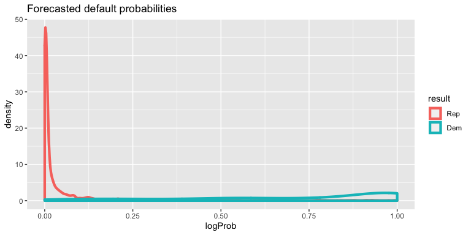
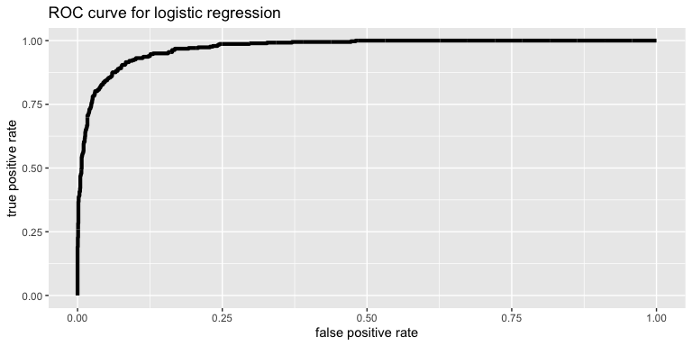
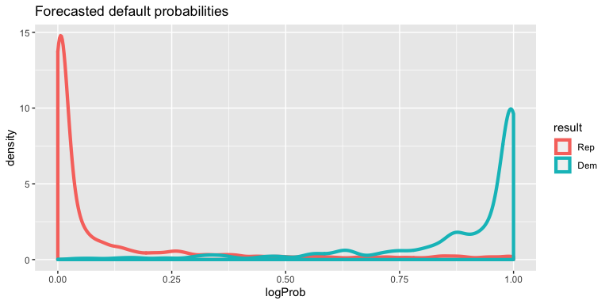
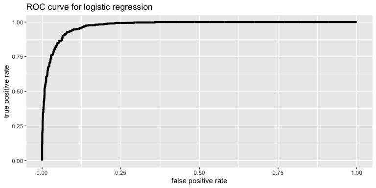
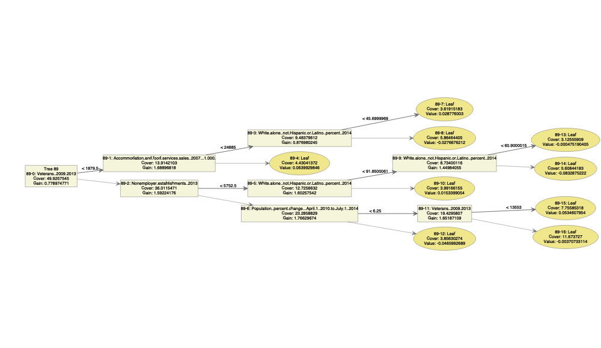
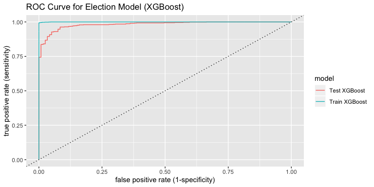

Project 2
================

## Bootstrapping

To begin, we started by analyzing the the samples we had. We created a
binary variable ‘result’, to represent that the specific winner was a
democrat (1) or republican (0). We then took the average of the samples,
and found that it was .15. This shows us that the data is heavily
republican leaning, and therefore to prevent the samples from being
skewed, we’d have to bootstrap samples to have an equal proportion of
democratic and republican samples.

## Models: Logistic Regression

We wanted to deteremine whether or not the data being skewed towared
Republican results would have an impact on our models. We therefore
analyzed the effects of bootstrapping on the dataset in relation to the
logistic regression. The point of this analysis was to see if there was
any benefit of bootstraping the data set. We chose to do this using a
logistic regression because we thought the effects of the bootstrapping
could be more clearly seen on the statistics we’d use to analyse the
performance, as there would be fewer confounding variables. If we used a
more complicated model, differences in other hyperparameters may also
have an impact on performance, and it would have been less clear to
compare the results of the models. Therefore, we started by creating
another bootstrapped data set where the proportion of Democratic and
Republic counties would be the same.

Non-Bootstrapped Data
<!-- --><!-- -->

    # A tibble: 1 x 3
      accuracy precision recall
         <dbl>     <dbl>  <dbl>
    1    0.941     0.851  0.738

Bootstrapped Data
<!-- --><!-- -->

    # A tibble: 1 x 3
      accuracy precision recall
         <dbl>     <dbl>  <dbl>
    1    0.923     0.914  0.932

Below, we see a table for the accuracy, precision, and recall for the
bootstrapped and non bootstrapped data. The values for the bootstrapped
data are slighlty mutable due to where we set our random seed for sample
collection, but through experimentation these values changed by .01 max
in each iteration.

| Data Set Type    | Accuracy | Precision | Recall |
| ---------------- | -------- | --------- | ------ |
| Non-Bootstrapped | .941     | .851      | .739   |
| Bootstrapped     | .923     | .914      | .932   |

Based on using a logistic regression, bootstrapping the data helped in
increasing the precision and recall, but not the accuracy. Given that
the non-bootstrapped method had more republic samples, it makes sense
that the accuracy is higher because if the model skews towards choosing
republican probabilities it will fare well on a data set which is
primarily republican. Therefore, the more important statistics of
precision and recall give us a better indicator of how well the model
fared. We can see since these values are higher and our accuracy is also
quite high, the model fares well in being able to classify both
republican and democratic samples.

Through this analysis, we can see that using a bootstrapped data set is
important and crucial in ensuring that our model is not skewed towards
fitting the republican samples better than the democratic samples.

## Models: Lasso Regression

Following this analysis, we wanted to see what were the most important
factors in determining which candidate would win. To do this, we used a
lasso regression. For our data set, we used the bootstrapped data set
because we could see that it was the data set which would lead to a more
accurate value.

``` 
52 x 1 sparse Matrix of class "dgCMatrix"
                                                                                    s0
(Intercept)                                                               1.825381e+00
`Population, 2014 estimate`                                               .           
`Population, 2010 (April 1) estimates base`                               .           
`Population, percent change - April 1, 2010 to July 1, 2014`             -5.660445e-02
`Population, 2010`                                                        .           
`Persons under 5 years, percent, 2014`                                    .           
`Persons under 18 years, percent, 2014`                                  -1.806850e-01
`Persons 65 years and over, percent, 2014`                               -3.736810e-02
`Female persons, percent, 2014`                                           1.949961e-02
`White alone, percent, 2014`                                             -1.495240e-02
`Black or African American alone, percent, 2014`                          .           
`American Indian and Alaska Native alone, percent, 2014`                  .           
`Asian alone, percent, 2014`                                              .           
`Native Hawaiian and Other Pacific Islander alone, percent, 2014`         .           
`Two or More Races, percent, 2014`                                        .           
`Hispanic or Latino, percent, 2014`                                       .           
`White alone, not Hispanic or Latino, percent, 2014`                     -7.744289e-02
`Living in same house 1 year & over, percent, 2009-2013`                  3.102002e-02
`Foreign born persons, percent, 2009-2013`                                .           
`Language other than English spoken at home, pct age 5+, 2009-2013`       .           
`High school graduate or higher, percent of persons age 25+, 2009-2013`   8.086136e-03
`Bachelor's degree or higher, percent of persons age 25+, 2009-2013`      1.145152e-01
`Veterans, 2009-2013`                                                     .           
`Mean travel time to work (minutes), workers age 16+, 2009-2013`          .           
`Housing units, 2014`                                                     .           
`Homeownership rate, 2009-2013`                                           .           
`Housing units in multi-unit structures, percent, 2009-2013`              6.579127e-02
`Median value of owner-occupied housing units, 2009-2013`                 4.253017e-06
`Households, 2009-2013`                                                   .           
`Persons per household, 2009-2013`                                        .           
`Per capita money income in past 12 months (2013 dollars), 2009-2013`     .           
`Median household income, 2009-2013`                                      .           
`Persons below poverty level, percent, 2009-2013`                         2.219475e-02
`Private nonfarm establishments, 2013`                                    .           
`Private nonfarm employment,  2013`                                       .           
`Private nonfarm employment, percent change, 2012-2013`                   .           
`Nonemployer establishments, 2013`                                        .           
`Total number of firms, 2007`                                             .           
`Black-owned firms, percent, 2007`                                        4.943485e-03
`American Indian- and Alaska Native-owned firms, percent, 2007`           1.270257e-03
`Asian-owned firms, percent, 2007`                                        .           
`Native Hawaiian- and Other Pacific Islander-owned firms, percent, 2007`  .           
`Hispanic-owned firms, percent, 2007`                                     8.775510e-03
`Women-owned firms, percent, 2007`                                        4.352712e-03
`Manufacturers shipments, 2007 ($1,000)`                                  .           
`Merchant wholesaler sales, 2007 ($1,000)`                                .           
`Retail sales, 2007 ($1,000)`                                             .           
`Retail sales per capita, 2007`                                           2.373838e-05
`Accommodation and food services sales, 2007 ($1,000)`                    .           
`Building permits, 2014`                                                  .           
`Land area in square miles, 2010`                                         .           
`Population per square mile, 2010`                                        .           
```

Through the Lasso Regression, we were able to determine which of the
variables were the most useful in determining who the winner would be.
The tables above shows the coefficient results of the Lasso regression.
If a value is non-zero, meaning there is a value next to it, the
variable was deemed important. Through this, we can then determine what
the most significant factors were in determining which candidate won.

## Models: Decision Tree (Random Forest)

Since some of the variables have much larger values than the others, the
regression models may be misled by giving more weights the variables of
large values, even though they might not be the major factors. To avoid
going through the complicated process of data normalization, the
following analysis uses a tree-based model, decision tree, and reduces
the effect of overfitting by the Random Forest algorithm.

    # A tibble: 1 x 3
      accuracy precision recall
         <dbl>     <dbl>  <dbl>
    1    0.954     0.864  0.825

The decision tree shown above has an accuracy of 93.4%, an error rate of
6.6%, a precision of 86.4% and a recall of 82.5% on predicting the
training data set. The recursive binary partitioning algorithm used for
a decision tree allows it to be very flexible, but prone to overfitting.
Therefore, though the model above demonstrate a relative high accurary,
the model may not behave as well on the testing data. To reduce the
effect of overftting, we choosed the random forest model. By using
bagging as an alternative of cross validation and random predictor
selection from the bootstrpped trees, the random forest model requires
less computation time and reduces the effect overfitting for better
prediction results in the test data set. The random forest model renders
the following result:

``` 

Call:
 randomForest(formula = winner16 ~ ., data = train_org) 
               Type of random forest: classification
                     Number of trees: 500
No. of variables tried at each split: 7

        OOB estimate of  error rate: 6.11%
Confusion matrix:
    Dem  Rep class.error
Dem 274  104  0.27513228
Rep  48 2063  0.02273804
# A tibble: 1 x 3
  accuracy precision recall
     <dbl>     <dbl>  <dbl>
1    0.939     0.851  0.725
```

The statistics calculated above suggests that the accuracy is 94.1% with
a 5.91% OOB estimate of error rate, the precision is 85.8% and the
recall is 73.3% in the random forest model. Although it seems to be less
accurate on predicting the training data, a slightly lower accuracy
indicates that the model reduce the effect of overfitting, which would
result in better predictions in the testing data.

Random Forest with Bootstrpped Data

``` r
> dim(train)
[1] 2489   56
> dim(train_bootstrapped)
[1] 4222   52
```

    # A tibble: 1 x 3
      accuracy precision recall
         <dbl>     <dbl>  <dbl>
    1    0.987     0.975      1

Based on the reasoning mentioned in the regression model parts, we also
conducted random forest algorithm on the bootstrapped data. The
statistics above demonstrated a large improvement on the accuracy,
precision and recall on the training data. The values are quite good for
the recall, but the accuracy and precision are lower and can be better.

## Models: Extreme Gradient Boosting (XGBoost)

We selected **Extreme Gradient Boosting** (XGBoost) as one of our
methods to make better predictions without aforementioned problems of
overfitting.

XGBoost is a decision-tree-based ensemble algorithm that employs
gradient descent algorithm to minimize errors in sequential models. In
fact, the algorithm uses regularization to avoid overfitting its models
(LASSO and Ridge Regularizations). Even though its parallelization
process could be helpful, we did not employ the function due to
reproducibility problem.

In order to implement the algorithm, we transformed existing dataset
into matrices, then randomly selected samples from train dataset with
1:3 ratio. After splitting independent and dependent variables, we set
basic settings, then ran the base model.

Due to intricacies of formatting in XGboost, we sampled the train data
separately from other models. We used `forcats` library to recode the
levels for compatibility with running `prediction` function with XGBoost
and `caret` library for training and tuning processes:

``` r
> 
> train_prep <- train_org %>%
+   mutate(winner16 = fct_recode(winner16, Dem = "Dem", Rep = "Rep"))
>  
> set.seed(123)
> train_smp_sz <- floor(0.67*nrow(train))
> train_ind <- sample(seq_len(nrow(train)), size = train_smp_sz)
```

For further tuning processes, we set the algorithm at 500 iterations,
with a 10-Fold Cross Validation setting.

There are total of five hyperparameter tunings that we executed: 1. Grid
Search,  
2\. Maximum Depth and Minimum Child Weight,  
3\. Column and Row Sampling,  
4\. Gamma, and  
5\. Learning
Rate

``` 
  nrounds eta max_depth gamma colsample_bytree min_child_weight subsample
1      90 0.1         4   0.5                1                3         1
eXtreme Gradient Boosting 

1667 samples
  51 predictor
   2 classes: '0', '1' 

No pre-processing
Resampling: None 
```

Final fitted decision tree is described as below:

<!-- -->

It seems that our XGBoost utilizes less trees and parameters, relative
to our Random Forest model. Even though we cannot simply exclude a
possibility of overfitting by comparing the number, it indicates that
there could be less overfitting in XGBoost model.

After we fitted the model, we made predictions on both training and
testing data sets, then assessed Confusion Matrix and ROC curve / AUC
values for a comparison of our models.

``` r
> # make prediction
> train_c <- train_c %>%
+   mutate(probs1 = as.list(predict(xgb_model, type = "prob", newdata = train_c))[[2]], prediction1 = ifelse(probs1 >= 0.6, "Rep", "Dem")) %>%
+   mutate(winner16 = fct_recode(factor(winner16), Dem = "0", Rep = "1"), prediction1 = factor(prediction1))
> 
> test_c <- test_c %>%
+   mutate(probs1 = predict(xgb_model, type = "prob", newdata = test_c)[[2]], prediction1 = ifelse(probs1 >= 0.6, "Rep", "Dem")) %>%
+   mutate(winner16 = fct_recode(factor(winner16), Dem = "0", Rep = "1"), prediction1 = factor(prediction1))
```

## Analysis: Simple Random Forest vs. XGBoost

While Random Forest and XGBoost both utilizes decision tree as their
fundamental design, we initially assessed XGBoost model due to its
**regularization** feature, which minimizes overfitting issues.

First, we looked at confusion matrices of our sample train and test
data:

``` r
> # Confusion Matrix
> (stats_train_xgb <- train_c %>% summarize(accuracy = mean(winner16 == prediction1),
+                                           precision = sum(winner16 == "Rep" & prediction1 == "Rep")/sum(prediction1 == "Rep"),
+                                           recall = sum(winner16 == "Rep" & prediction1 == "Rep")/sum(winner16 == "Rep")) )
   accuracy precision    recall
1 0.9964007 0.9978693 0.9978693
> 
> (stats_test_xgb <- test_c %>% summarize(accuracy = mean(winner16 == prediction1),
+                                           precision = sum(winner16 == "Rep" & prediction1 == "Rep")/sum(prediction1 == "Rep"),
+                                           recall = sum(winner16 == "Rep" & prediction1 == "Rep")/sum(winner16 == "Rep")) )
   accuracy precision    recall
1 0.9549878 0.9798271 0.9672831
```

Hence, a confusion matrix of overall train data is as the following:

``` r
> train_prep %>% mutate(winner16 = as.numeric(winner16) - 1) %>%
+   mutate(probs1 = predict(xgb_model, type = "prob", newdata = train_prep)[[2]], prediction1 = ifelse(probs1 >= 0.6, "Rep", "Dem")) %>%
+   mutate(winner16 = fct_recode(factor(winner16), Dem = "0", Rep = "1"), prediction1 = factor(prediction1)) %>%
+   summarize(accuracy = mean(winner16 == prediction1),
+             precision = sum(winner16 == "Rep" & prediction1 == "Rep")/sum(prediction1 == "Rep"),
+             recall = sum(winner16 == "Rep" & prediction1 == "Rep")/sum(winner16 == "Rep"))
# A tibble: 1 x 3
  accuracy precision recall
     <dbl>     <dbl>  <dbl>
1    0.983     0.992  0.988
```

If we compare this to Random Forest Model,

| Data Set Type   | Accuracy | Precision | Recall |
| --------------- | -------- | --------- | ------ |
| Random Forest   | .939     | .851      | .725   |
| XGBoost - Test  | .955     | .980      | .967   |
| RF - Bootstrap  | .987     | .975      | 1      |
| XGBoost - Total | .983     | .992      | .988   |

From the chart above, we can see that both Random Forest (with
Bootstrapping) and XGBoost performed well, with XGBoost having lower
accuracy and higher precision. At this point, we cannot firmly conclude
that either model will perform better on actual test data. However, if
theoretical assumption of XGBooost (Regularization) turns out to be true
on the data, we would prefer XGBoost to Random Forest algorithm. Also,
we need to acknowledge that such results could change depending on seed
selection, suggesting that XGBoost could outperform under different
circumstances given slim differences we observed.

Now, we will consider ROC / AUC values to further assess the two models.

First, we created ROC curves for train and test samples of XGBoost:

``` r
> # creating ROC curve for the model
> preds_xg_train <- prediction(train_c$probs1,train_c$winner16, label.ordering=c("Dem", "Rep"))
> perf_xg_train <- performance(preds_xg_train, "tpr", "fpr")
> perftr_xg_df <- data_frame(fpr=unlist(perf_xg_train@x.values),
+                        tpr= unlist(perf_xg_train@y.values),
+                        threshold=unlist(perf_xg_train@alpha.values),
+                        model="Train XGBoost")
> 
> preds_xg_test <- prediction(test_c$probs1,test_c$winner16, label.ordering=c("Dem", "Rep"))
> perf_xg_test <- performance(preds_xg_test, "tpr", "fpr")
> perfte_xg_df <- data_frame(fpr=unlist(perf_xg_test@x.values),
+                        tpr= unlist(perf_xg_test@y.values),
+                        threshold=unlist(perf_xg_test@alpha.values),
+                        model="Test XGBoost")
> 
> # drawing two ROC curves using bind_rows and ggplot
> xgb.perf_df2 <- bind_rows(perftr_xg_df, perfte_xg_df)
> ggplot(xgb.perf_df2, aes(x = fpr, y = tpr, color = model)) + geom_line() + labs(x = "false positive rate (1-specificity)", y = "true positive rate (sensitivity)", title = "ROC Curve for Election Model (XGBoost)") + geom_abline(slope = 1, intercept = 0, linetype = 3)
```

<!-- -->

Even though the above graphs could seem on-par or less convincing than
Random Forest algorithm, XGBoost algorithm seems to perform very well,
relative to conventional results. We could actually compare more
precisely by calculating AUC for each model:

    [1] 0.9998903
    [1] 0.9824522

The above AUC values buttress the above statement. However, when we
consider AUC of Random Forest (Bootstrapped) algorithm, the values are
slightly lower:

``` r
> # creating prob for Random Forest for ROC Comparison
> test_boot <- test_boot %>% 
+   mutate(prob_forest_boot = predict(train_bootstrapped_forest, test_boot, type="prob")[,1])
> 
> preds_rf <- prediction(test_boot$prob_forest_boot,test_boot$result, label.ordering=c("Dem", "Rep"))
> 
> auc.rf <- calc.auc(preds_rf)
> auc.rf
[1] 0.9997164
```

Overall, **Random Forest with Bootstrap Data seems to perform better
than XGBoost algorithm.** However, we cannot compare the two literally
since two utilizes different sets of training and testing data. Under
assumptions that regularization processes of XGBoost algorithm worked
perfectly and that Random Forest algorithm still has some potential of
overfitting, **we will select XGBoost as our final algorithm.**
